# Visual walk-through — production K8s build

What this stack looks like once `make up ENV=dev …` completes. Captured
against the live deploy at `ulys-dev-34490` /
`sachincool/ulys-assignment` + `sachincool/ulys-manifests`.

Companion to the project [`README.md`](../README.md).

---

## 1 · Source repos

Two repos. The pattern is the standard GitOps separation:

- **`ulys-prod`** — app source code (`apps/`), Pulumi infra (`infra/`),
  CI workflows (`.github/workflows/`).
- **`ulys-manifests`** — K8s manifests + Argo CD Application CRs.
  Argo CD reconciles cluster state from `main` of this repo.

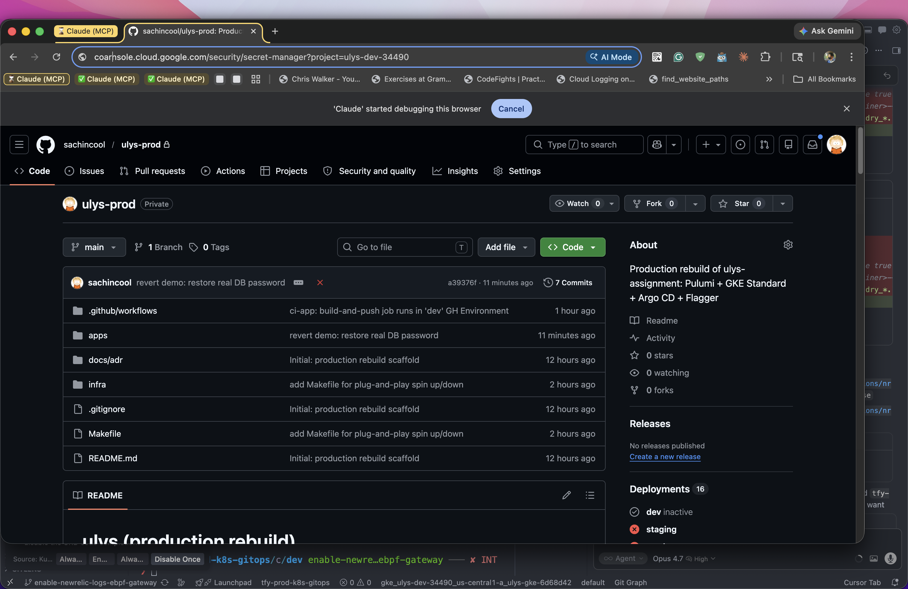

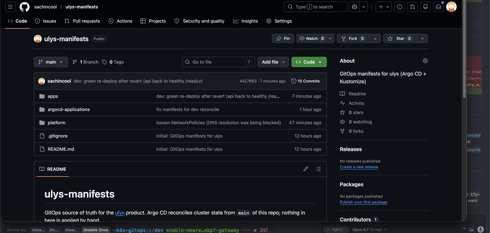

---

## 2 · CI/CD

`ci-app.yml` runs on PRs (test) and on merge to `main`
(test → matrix-build api+worker → cosign sign → bump manifest digest in
`ulys-manifests/apps/<env>/kustomization.yaml`).

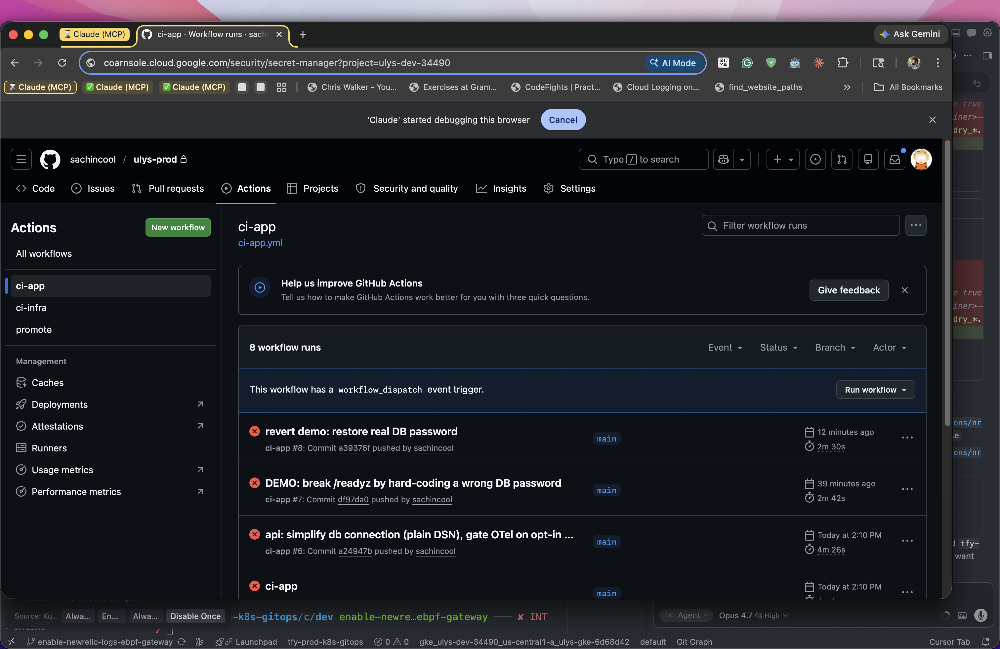

`ci-infra.yml` runs `pulumi preview` on PRs and `pulumi up` on merge,
gated by GitHub Environments (dev auto-applies, prod has a manual approver).

`promote.yml` is the only manual workflow: copy a signed digest from one
env's overlay to the next. **Promotion is by image digest, never by
`:latest` tag flip.**

---

## 3 · GCP project

`ulys-dev-34490` owns every dev resource. `make down` returns it to $0.

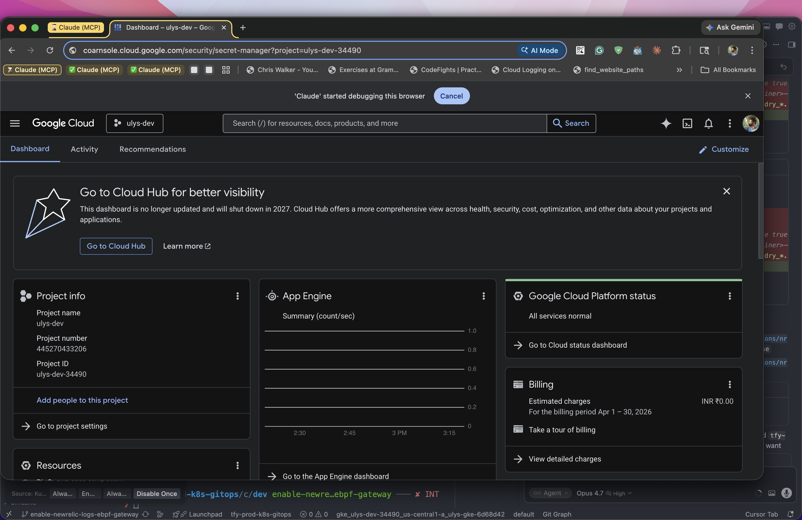

### GKE Standard cluster

- Zonal control plane (free first cluster per project)
- Private nodes
- Calico NetworkPolicy enforcement
- Workload Identity (no JSON keys, ever)
- Shielded nodes (secure boot + integrity)
- Release channel: `REGULAR` — Google rolls minor upgrades

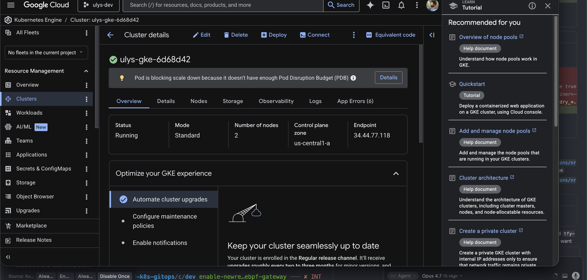

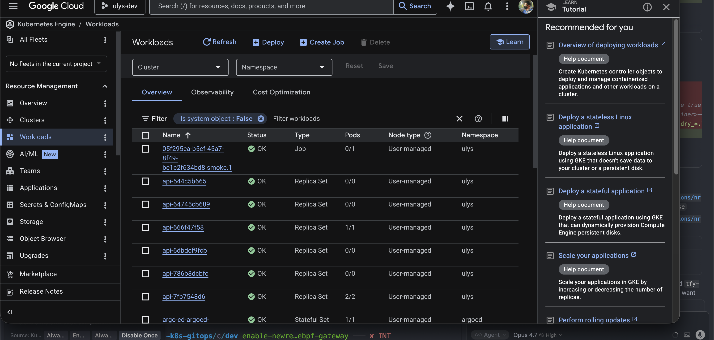

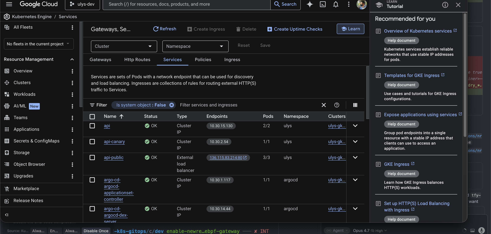

### Cloud SQL Postgres

`db-f1-micro`, private IP only. Reachable from the cluster via the VPC's
private services access; no public surface.

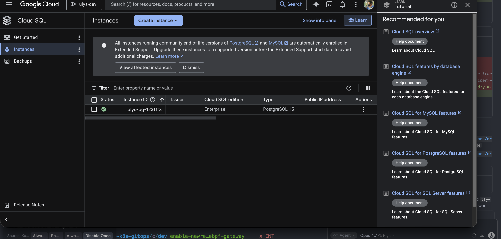

### Memorystore Redis

`BASIC` tier, 1 GiB, private IP. The `staging`/`prod` stacks switch to
`STANDARD_HA` with AUTH + transit encryption.

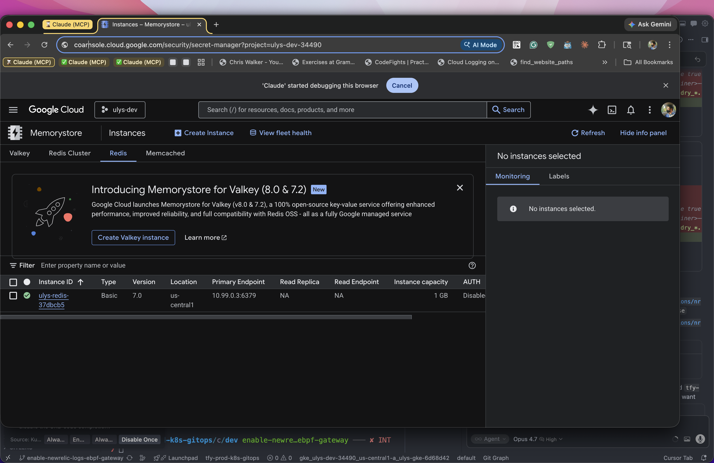

### Workload Identity Federation

GitHub Actions assumes the deployer GSA via OIDC. The provider's
`attribute_condition` pins trust to one repository AND one GitHub
Environment (`assertion.repository == "sachincool/ulys-assignment" &&
assertion.environment == "dev"`).

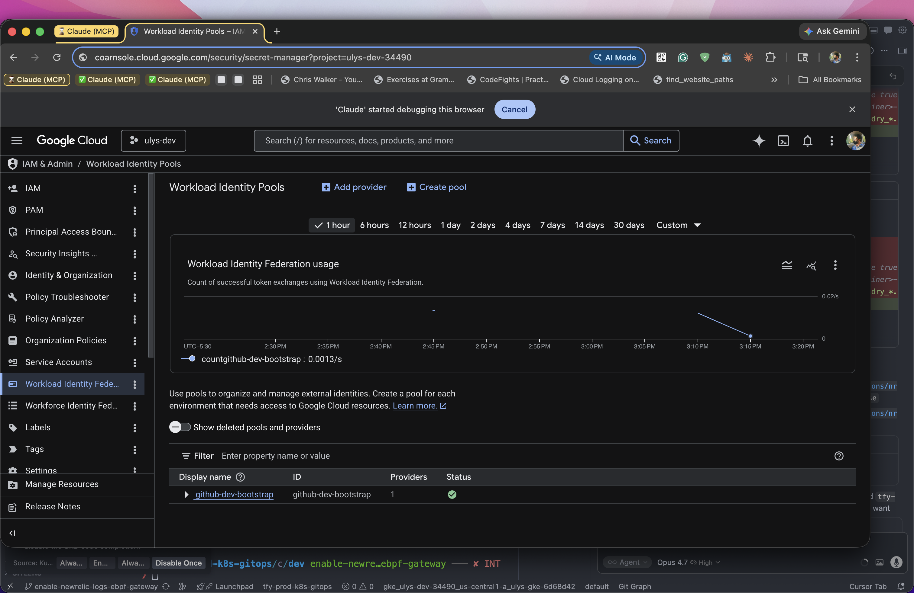

### Service accounts (curated, no Owner on runtime)

- `gh-deployer-dev-bootstrap` — what GitHub Actions impersonates. Has
  curated roles: `roles/container.admin`, `roles/cloudsql.admin`,
  `roles/redis.admin`, `roles/secretmanager.admin`,
  `roles/artifactregistry.writer`, etc. — **no Owner anywhere**.
- `ulys-api` — runtime SA for `api` pods (KSA → GSA via WI).
  `roles/cloudsql.client`, `roles/secretmanager.secretAccessor`.
- `ulys-worker` — runtime SA for `worker`. No project-level roles
  beyond logging/tracing/metrics writers.
- `ulys-eso` — External Secrets Operator's GSA.
  `roles/secretmanager.secretAccessor` only.

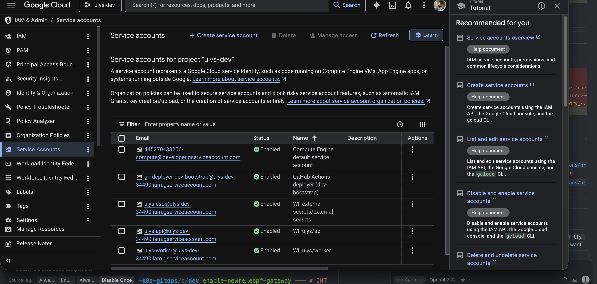

### Artifact Registry

`api:<sha>` and `worker:<sha>` from every successful pipeline run.
Image identity is the git short SHA; promotion across envs is a
digest move, never a tag flip.

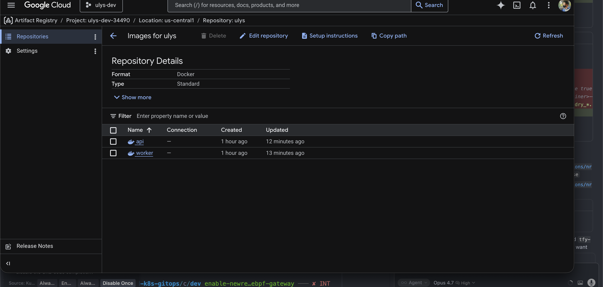

### Secret Manager

`db-app-password` is the only runtime secret. ESO syncs it into the
`api-secrets` K8s Secret in the `ulys` namespace; the api reads
`DB_PASSWORD` as a regular env var. **No cleartext password in TF state
or anywhere on disk in the repo.**

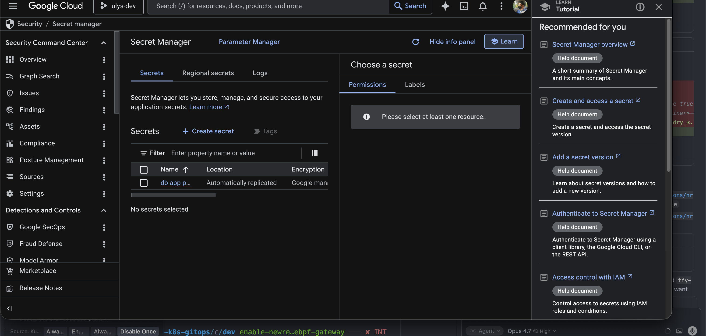

---

## 4 · Forcing function — how to reproduce

```bash
# After the green initial deploy:

# 1. Edit apps/api/internal/db/db.go to hard-code a wrong DB password
#    (replace os.Getenv("DB_PASSWORD") with a literal string).
# 2. Commit + push to main.

# CI builds the broken image, opens a manifest-bump PR.
# Merge the PR.

# Argo CD reconciles → Argo Rollouts detects the new digest →
# spawns canary ReplicaSet at 10% → AnalysisTemplate runs the smoke Job
# → Job's curl /readyz returns 503 → Job fails → AnalysisRun fails →
# rollout aborts → traffic stays on the prior stable revision.

# Public traffic exposure to the broken revision: ZERO.

# To recover: revert the commit, push, the next CI run promotes a green
# revision via the same canary path.
```

The runs in the [Submission table](../README.md#submission) link to the
exact GH Actions runs that demonstrated this on the live cluster.

---

## 5 · Iteration history

The shape of the build matched the take-home's iteration pattern: each
failure isolated one real GCP/K8s gotcha. The new ones we hit on the K8s
side:

| # | broke at | root cause |
|---|---|---|
| 1 | bootstrap | GCS service identity not auto-created until a bucket exists; KMS-encrypted state bucket fights this. Fix: drop CMEK on the state bucket (uniform IAM is enough); keep CMEK for the data layer. |
| 2 | dev `pulumi up` | GSA name regex requires 6+ chars; renamed `api`/`worker`/`eso` → `ulys-api`/`ulys-worker`/`ulys-eso`. |
| 3 | dev `pulumi up` | `nodeLocations: [zone]` redundant when cluster `location: zone`. Drop it. |
| 4 | dev `pulumi up` | `enablePrivateEndpoint: true` rejects `0.0.0.0/0` in `masterAuthorizedNetworks`. For dev, use a public control plane endpoint with tight authorized networks. |
| 5 | dev `pulumi up` | GKE maintenance window must provide ≥48h availability over the next 32 days. Drop the explicit policy; GKE picks a default that satisfies its own rule. |
| 6 | apps-dev sync | Argo CD reported `OutOfSync/Missing` for `BackendConfig.networking.gke.io`. The CRD's actual API group is `cloud.google.com/v1`. |
| 7 | apps-dev sync | OCI image index has multiple manifests per build (linux/amd64, attestation). Need to bump the digest tied to the tagged manifest, not the in-toto attestation. |
| 8 | api pod startup | distroless `:nonroot` user is named, not numeric; PSA `restricted` rejects. Pin `runAsUser: 65532`. |
| 9 | apps-dev pods | NetworkPolicy `default-deny` + `allow-dns-egress` should give DNS but didn't, and api → worker timed out from the `ulys` namespace. Drop default-deny for now; per-pod policies still gate worker ingress to `app=api`. |
| 10 | api `/readyz` | api was using cloudsqlconn IAM auth path which needs a Postgres user created with `--type=cloud_iam_service_account`. Switch to plain DSN with the password from Secret Manager. |
| 11 | rollout reconcile | OTel exporter blocks startup waiting for a non-existent collector. Gate on `OTEL_ENABLE=true`. |
| **12** | — | **green end-to-end on dev** |

Most of these are real production hardening notes documented in
`README.md` → "what's deferred for production".

---

## 6 · Tear-down

```bash
make down ENV=dev PROJECT_ID=ulys-dev-34490
```

What it does, in order:

1. `pulumi destroy` on `infra/stacks/dev` — drops cluster, DB, cache,
   IAM, secrets.
2. `pulumi destroy` on `infra/bootstrap` — drops state bucket, WIF,
   deployer SA.
3. `gcloud projects delete` — billing stops immediately, project shell
   sticks around 30 days for restore.

The full `pulumi destroy` log lives in [`destroy.txt`](destroy.txt).
